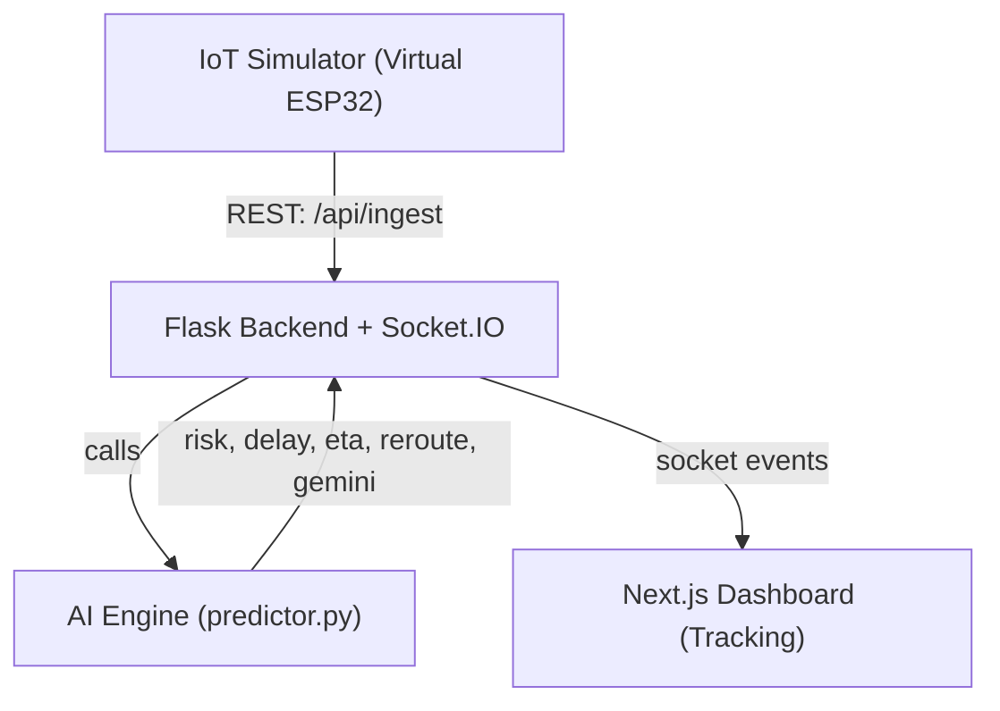

# ChainGuard (ChainGuard AI Supply Chain Monitor)

ChainGuard is a hackathon-ready, end-to-end prototype for real-time shipment monitoring. It ingests GPS + sensor telemetry, runs an AI pipeline (risk score, delay prediction, rerouting decision, and Gemini explanation), and streams the results to a live operations dashboard.

This repo is structured for a 4-person build:
- Person A: IoT simulator (telemetry generation / MQTT)
- Person B: Backend (Flask + Socket.IO, APIs, integrations)
- Person C: AI engine (ML models + rule-based fallback + Gemini explainer)
- Person D: Frontend (Next.js dashboard)

## Problem Statement
Supply chains fail quietly. Small issues (speed drops, temperature drift, low tracker battery, bad weather) escalate into major delays and spoilage before a human notices. Operations teams need:
- Live visibility (not end-of-day reports)
- Early warnings (not post-mortems)
- Actionable guidance (not just dashboards)

## Solution
ChainGuard turns raw telemetry into decisions:
- Risk score (0.0 to 1.0) and category (SAFE / WARNING / CRITICAL)
- Delay prediction (minutes)
- ETA impact and suggested action (MONITOR / RECOMMEND_REROUTE / AUTO_REROUTE)
- Route alternatives using OpenRouteService (fallback to mock when key missing)
- Gemini explanation (Google AI) for human-readable operational guidance

## Google Technologies Used (Judging)
- Gemini API: natural-language explanations for operational alerts (`GEMINI_API_KEY`)
- Google Cloud Run (recommended): backend deployment target for the Flask API
- Optional: Google Maps Routes API support exists in the backend as a fallback if configured (`GOOGLE_MAPS_KEY`)

## Repository Layout
```text
ai-engine/          ML + rules + rerouting + Gemini explainer
backend/            Flask API, Socket.IO, ingestion, storage
frontend/           Next.js operations dashboard
iot-simulator/      Local simulator utilities (optional)
docs/               Architecture, setup, and submission docs
```

## Architecture (1-minute read)


## Demo (Judges)
- Track Shipment -> Open IoT Simulator -> change telemetry -> observe AI + rerouting update live.
- Add a screenshot or GIF here before submitting (judges decide fast):
  - `docs/assets/dashboard.png`


## Quick Start (Windows / PowerShell)
### 1. Backend
```powershell
cd "backend"
pip install -r requirements_backend.txt
python app.py
```
Backend endpoints:
- `GET /api/health`
- `GET /api/shipments`
- `POST /api/ingest`

### 2. Frontend
```powershell
cd "frontend"
npm.cmd install
npm.cmd run dev
```
Open:
- `http://localhost:3000/login`

Note: Auth is demo-mode (localStorage) so judges can sign up and start immediately.

### 3. Demo Telemetry (Judge Flow)
1. Login
2. Add a shipment (Dashboard)
3. Open Track Shipment
4. Click "Open IoT Simulator"
5. Change temperature/speed/location
6. Watch AI risk, delay, ETA, reroute, and Gemini explanation update live

## Environment Keys (Recommended)
Create `backend/.env` (see `.env.example`):
```env
AUTH_REQUIRED=false
ALLOWED_ORIGINS=http://localhost:3000,http://127.0.0.1:3000

# Google AI (Gemini)
GEMINI_API_KEY=your_key_here

# Routing
OPEN_ROUTE_SERVICE_KEY=your_key_here

# Weather
OPEN_WEATHER_KEY=your_key_here
```

## Model Training (Optional)
The AI engine includes training scripts and supports both synthetic datasets and external CSV datasets.
See:
- `ai-engine/train.py`
- `docs/model.md`

## Deployment (Recommended for Hackathons)
- Frontend: Firebase Hosting or Vercel
- Backend: Google Cloud Run
- Secrets: environment variables (or Secret Manager)

## Documentation
Start here:
- `docs/README.md`
